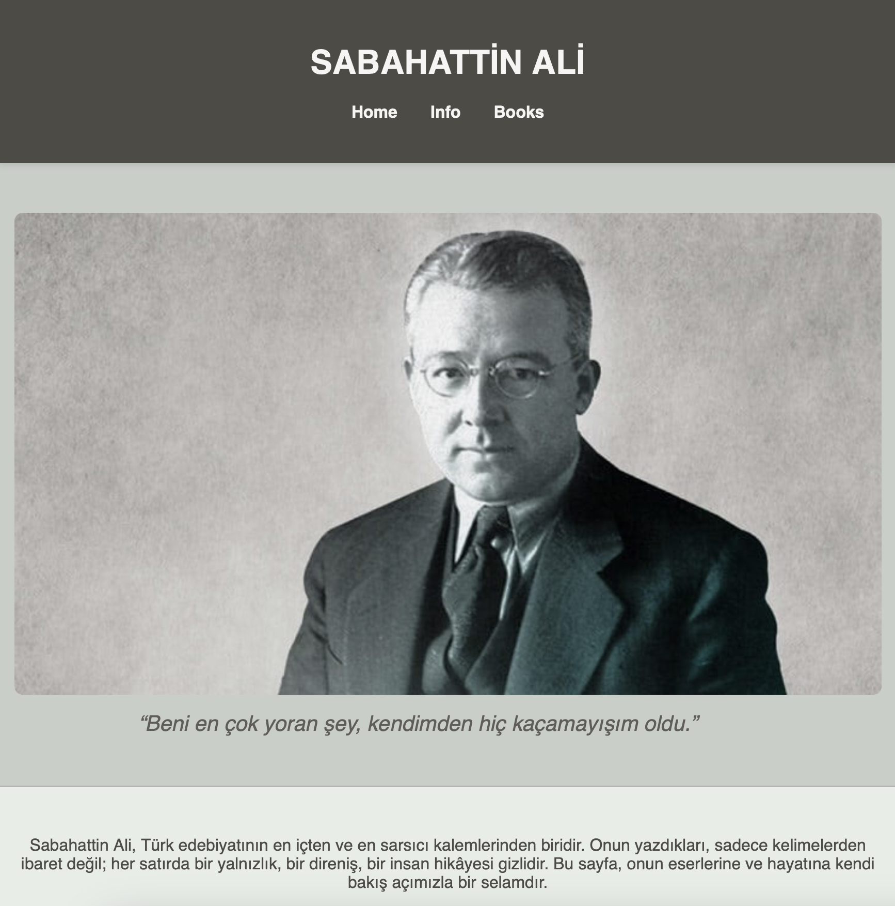
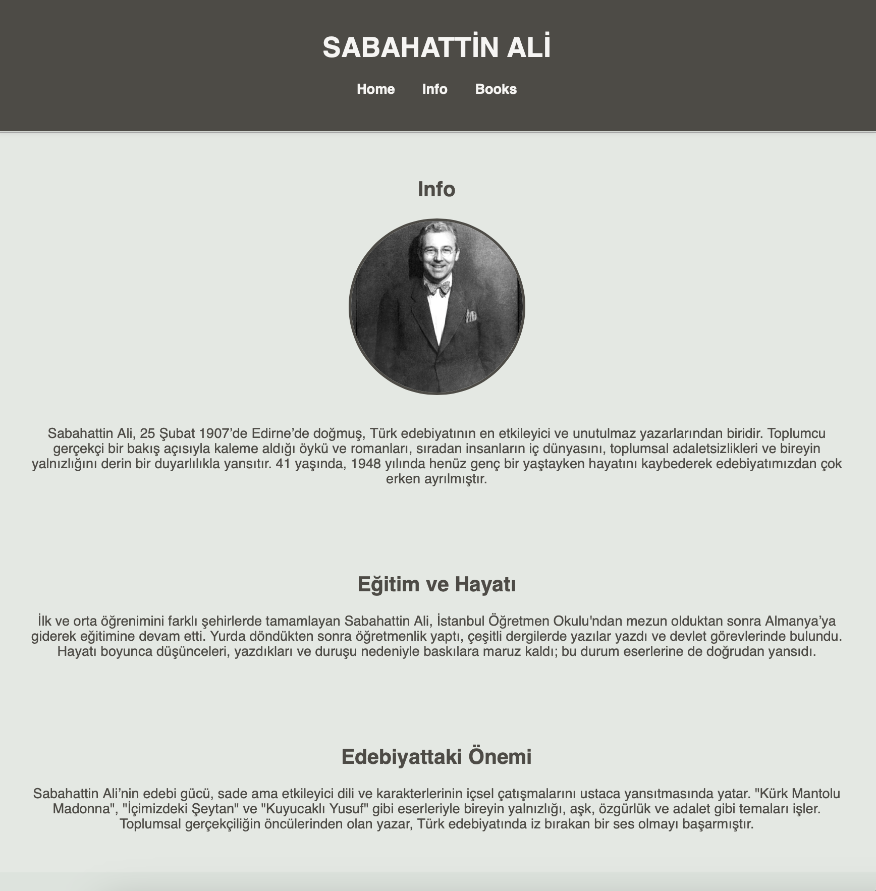

# Tribute Website - Sabahattin Ali

Bu proje, Türk edebiyatının eşsiz kalemi **Sabahattin Ali’yi anmak ve onun eserlerini, hayatını sizlerle paylaşmak için hazırlandı.  

Sabahattin Ali’nin derinlikli dünyasını yansıtan sade ve samimi bir web sitesi oluşturuldu. Burada onun biyografisini, en önemli kitaplarını ve etkileyici alıntılarını bulabilirsiniz. Tasarımda yumuşak pastel tonlar ve okunabilirlik ön planda tutuldu.

---

## Projede Neler Yaptık?

- **Başlık ve navigasyon** ile sayfa içinde rahat gezinme sağladık.  
- Giriş bölümünde yazarın fotoğrafı ve ünlü bir alıntısını öne çıkardık.  
- Biyografi kısmında hayatından kesitler ve edebi yolculuğunu anlattık.  
- Kitaplar bölümünde eserlerini kapak görselleriyle listeledik ve her kitabın kısa tanıtımını yaptık.  
- Tasarımda pastel renkler kullanarak gözü yormayan, akıcı ve estetik bir görünüm elde ettik.  
- Sayfayı tek sayfa halinde, scroll ile akıcı bir şekilde gezilebilir yaptık.  
- Ayrıca bu README dosyasını oluşturarak projeyi ve yaptığımız işleri özetledik.  

## Projedeki Görseller

Projede kullandığımız görselleri aşağıda görebilirsiniz:

  
  
  

---

## Teknolojiler

- HTML5  
- CSS3  

---

© 2025 Fatma Nur Yiğit - Ödev

